<div align="center">

# Open Omnibot

**An open-source mecanum-wheel mobile robot platform with automated per-motor feedforward calibration.**

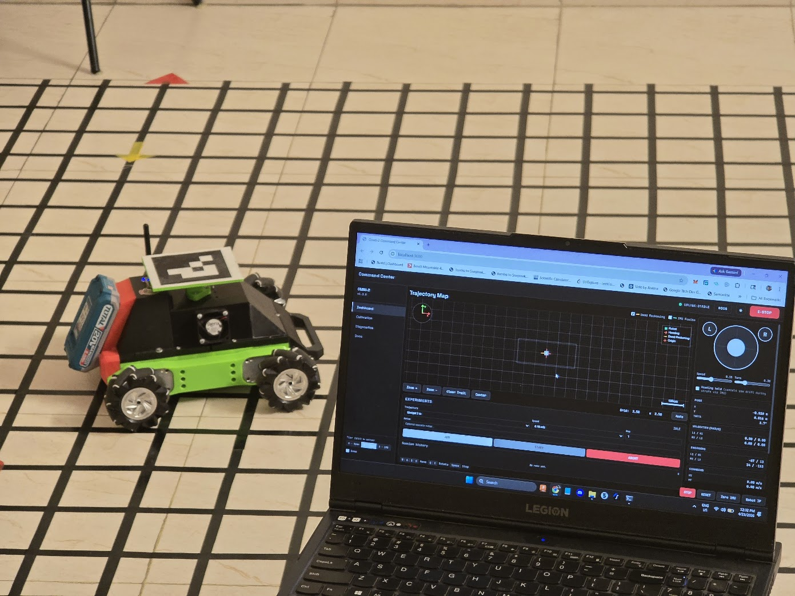

Hardware · Firmware · Server · Dashboard · Docs · MIT-licensed

</div>

---

## What this is

Open Omnibot is an integrated low-cost research and teaching platform
for indoor mobile robotics. The release covers everything needed to
reproduce, drive, instrument, and extend a four-wheel mecanum robot —
from the bill of materials and pinout through the firmware control
loop to a browser dashboard with calibration and experiment-runner
tools.

The project was developed as an undergraduate research platform and
has been used as the basis for academic publications on motor
calibration and platform reproducibility (see *Citation* below).

### At a glance

| | |
|---|---|
| **Bill of materials** | ~USD 173 |
| **Drivetrain** | 4 × 80 mm mecanum wheels, 42 : 1 geared DC motors, magnetic 13 PPR encoders (1092 CPR post-gearbox, quadrature-decoded) |
| **Compute** | ESP32 (MH ET LIVE MiniKit) — WiFi, OTA, PCNT-based encoder readout |
| **Motor drive** | 2 × TB6612FNG H-bridges, direction lines on MCP23017 expander |
| **IMU** | BNO055 in IMUPLUS mode (gyro + accel; magnetometer disabled due to motor interference) |
| **Control rate** | 50 Hz per-wheel PID, 20 Hz telemetry stream |
| **Calibration** | Automated per-motor feedforward state machine, NVS-persisted |
| **Server** | Node.js, ~170 unit/integration tests |
| **Dashboard** | Joystick, 2D map, motor diagnostics, IMU calibration, experiment runner, docs viewer |
| **License** | MIT |

---

## Table of contents

1. [Platform overview](#platform-overview)
2. [Hardware](#hardware)
3. [Firmware](#firmware)
4. [Server and dashboard](#server-and-dashboard)
5. [Automated calibration](#automated-calibration)
6. [Localization](#localization)
7. [Documentation](#documentation)
8. [Repository structure](#repository-structure)
9. [Getting started](#getting-started)
10. [Status and scope](#status-and-scope)
11. [Citation](#citation)
12. [License](#license)

---

## Platform overview

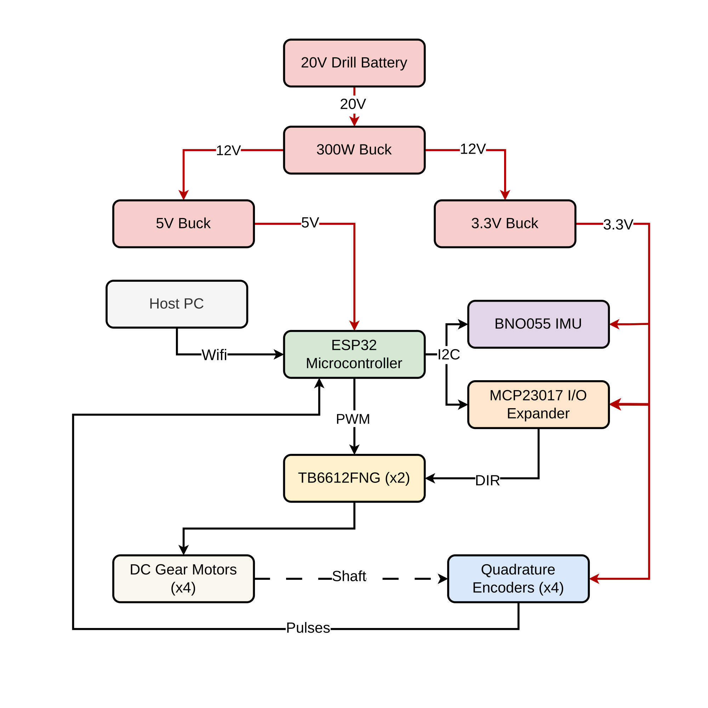

A 3D-printed PETG chassis carries four geared mecanum-wheel motors,
two H-bridge drivers, an ESP32 controller, and a BNO055 IMU. Power
comes from a 20 V cordless-drill battery feeding a 300 W buck for
the motor rail and two smaller bucks for the 5 V and 3.3 V logic
rails. The ESP32 talks to a host PC over WiFi (WebSocket) — there
is no tether.

<div align="center">

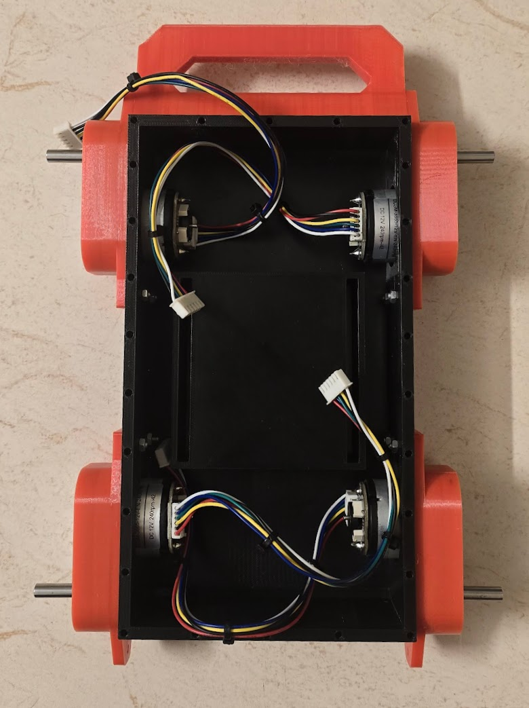
&nbsp;
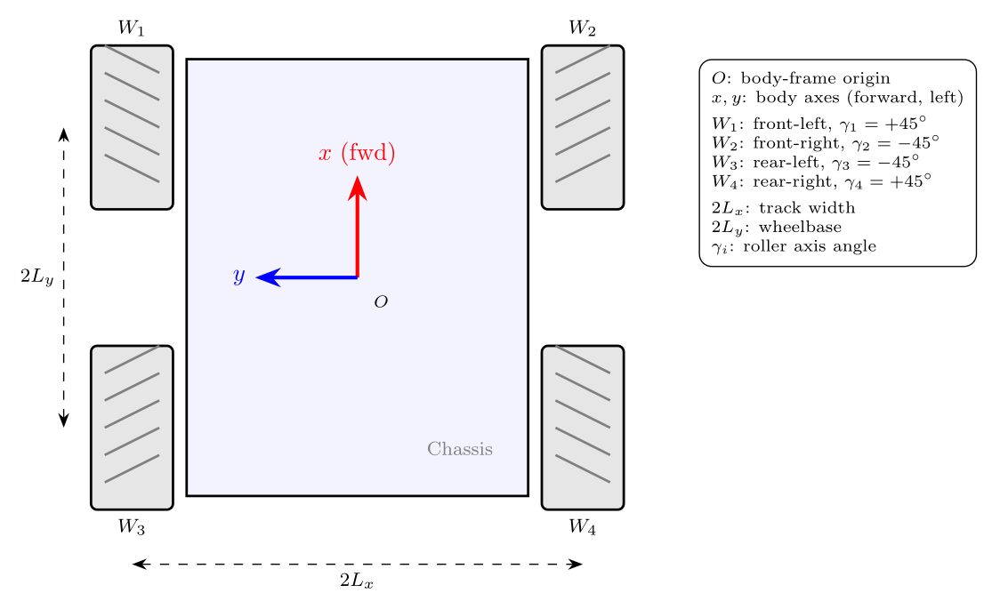

*Left: the assembled robot. Right: mecanum wheel orientation
(rollers at ±45° to the wheel axis).*

</div>

---

## Hardware

Full bill of materials lives in [`hardware/bom.csv`](hardware/bom.csv);
the canonical pinout and component-by-component rationale live in
[`hardware/README.md`](hardware/README.md) and
[`docs/hardware/00-components.md`](docs/hardware/00-components.md).

### Key components

<div align="center">

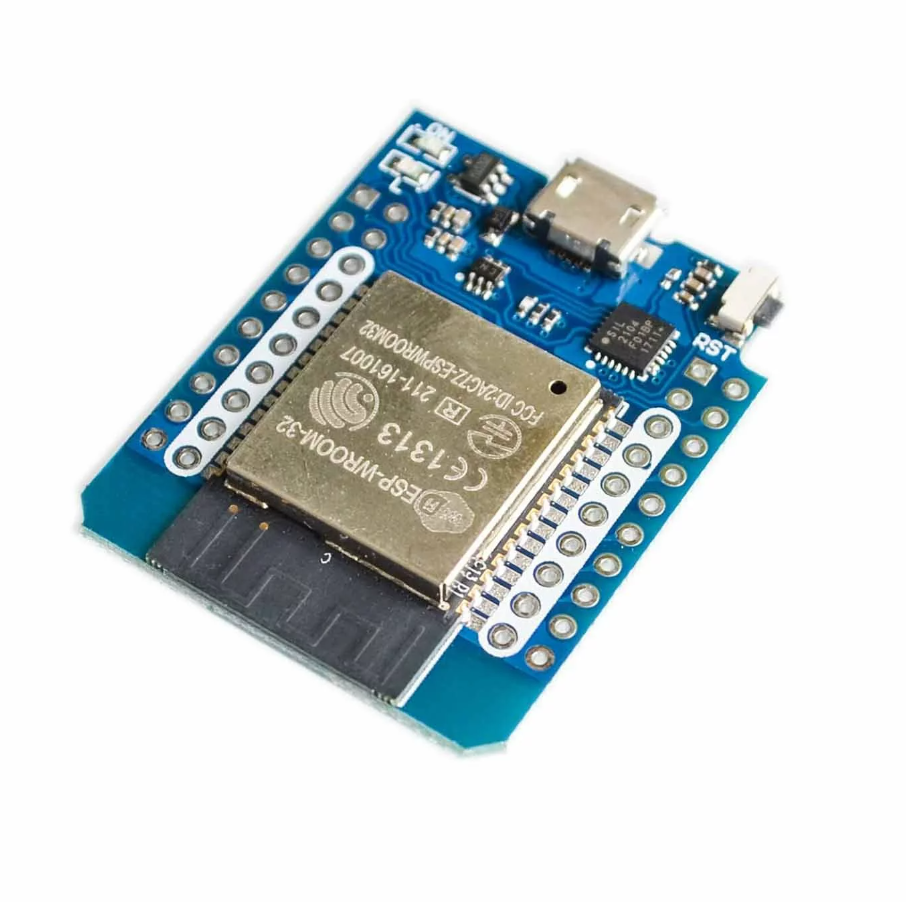
&nbsp;
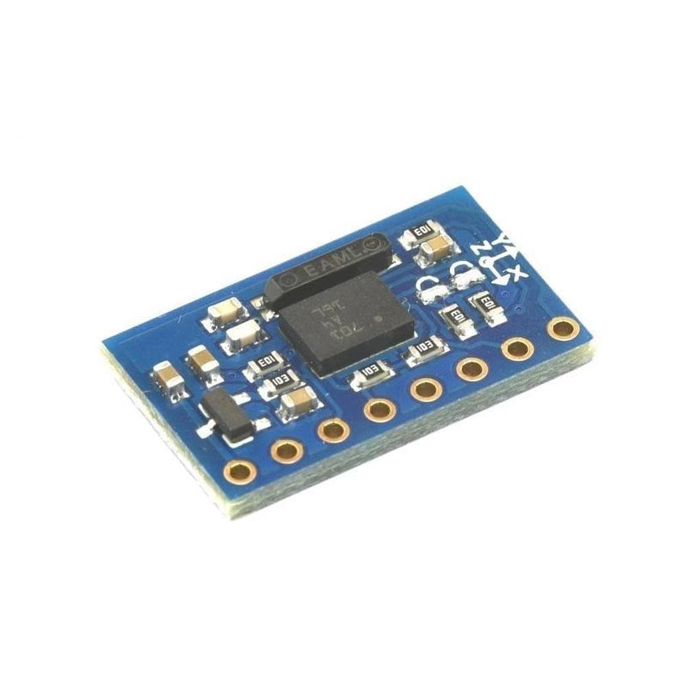
&nbsp;
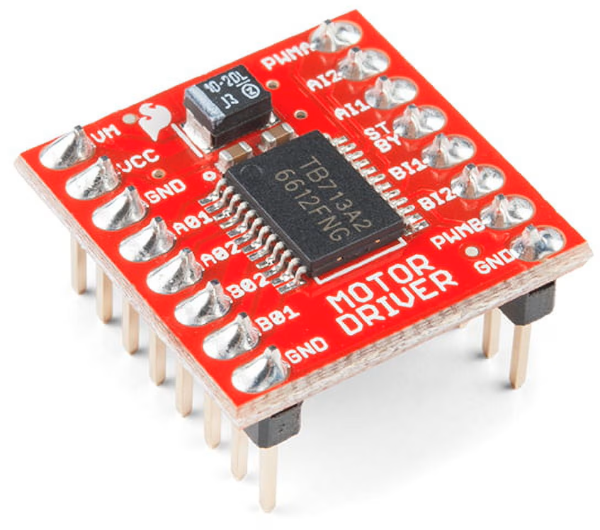
&nbsp;
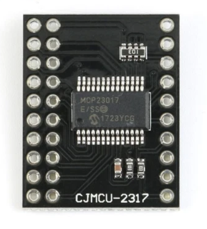

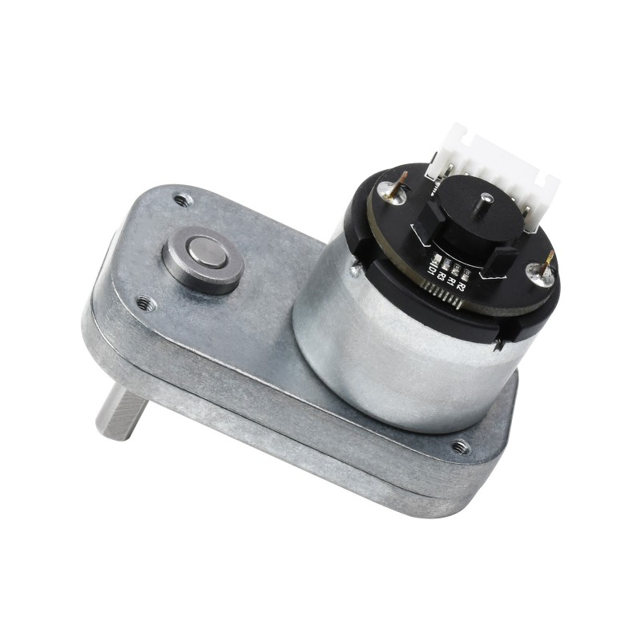
&nbsp;
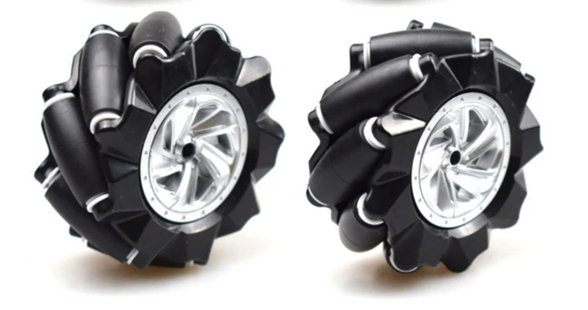

</div>

| Component | Role | Notes |
|---|---|---|
| ESP32 (MH ET LIVE MiniKit) | Main controller | WiFi for telemetry/OTA, PCNT for quadrature decode |
| BNO055 | 9-axis IMU | Runs in IMUPLUS mode; magnetometer deliberately disabled |
| TB6612FNG × 2 | Dual H-bridge motor drivers | 4 motor channels total |
| MCP23017 | I²C I/O expander | Frees ESP32 GPIO, isolates direction lines from PWM transients |
| Geared DC motor × 4 | Wheel actuators | 42 : 1 gearbox, 13 PPR magnetic encoder per motor |
| Mecanum wheel × 4 | Drivetrain | 80 mm, ±45° passive rollers |
| 20 V drill battery | Main power | Robust under stall current; replaced an earlier 18650 pack that sagged |
| BNO055 | 9-axis IMU | Mounted away from motors as far as the chassis allows |

### Kinematic constants

| Parameter | Symbol | Value |
|---|---|---|
| Wheel radius | r | 40 mm |
| Half-track width | Lx | 0.1175 m |
| Half-wheelbase | Ly | 0.0953 m |
| Encoder CPR (post-gearbox, quadrature-decoded) | — | 1092 counts / wheel revolution |
| PWM frequency | — | 1 kHz, 8-bit |

---

## Firmware

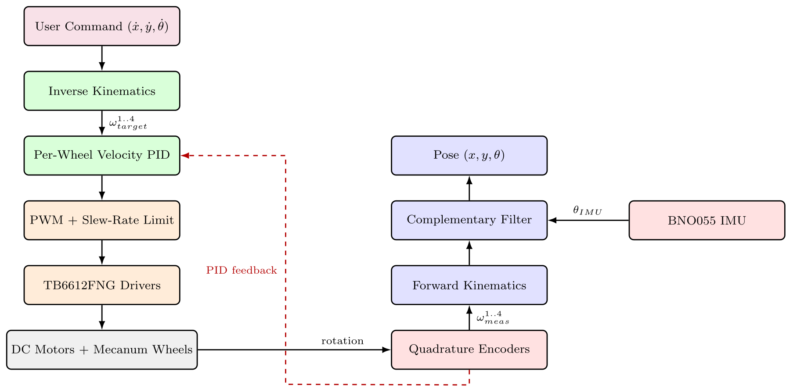

A PlatformIO project under [`firmware/esp32-omni/`](firmware/esp32-omni/),
written in Arduino-flavoured C++. Cooperative main loop (not FreeRTOS
tasks) at **50 Hz** for per-wheel PID and motor control, with a **20 Hz**
WebSocket telemetry broadcast.

### Highlights

- **Per-wheel velocity PID** with anti-windup and slew limit (Kp=20,
  Ki=25, Kd=0.05).
- **Quadrature decode via ESP32 PCNT** with explicit 16-bit overflow
  handling — unit-tested in `firmware/esp32-omni/test/`.
- **Motor calibration state machine** (described below).
- **OTA upload** in two forms: HTTP (push from any host) and ArduinoOTA
  (PlatformIO integration). HTTP is preferred from WSL2 since it
  doesn't need firewall rules.
- **Trajectory executor with firmware-level pause/resume**, so multi-
  waypoint trajectories can pause for ground-truth capture without
  surging between segments.

### Building

```bash
cd firmware/esp32-omni
pio run                        # build only
pio run -t upload              # USB upload
pio run -t upload -e ota --upload-port robot.local   # OTA upload
```

Native unit tests:

```bash
cd firmware/esp32-omni
pio test -e native
```

Tests cover odometry, encoder overflow logic, openloop trajectory
execution, and the trajectory FSM.

---

## Server and dashboard

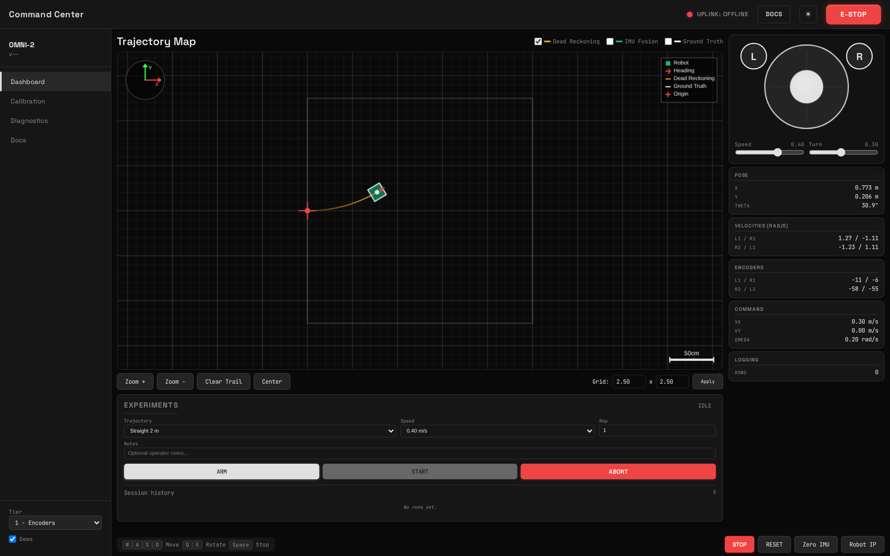

A Node.js server under [`server/`](server/) sits between the robot
and the operator. It maintains the WebSocket link, logs ~40 columns
of telemetry to CSV with a JSON metadata sidecar, runs the
localization tiers, and serves a browser dashboard.

### Server pipeline

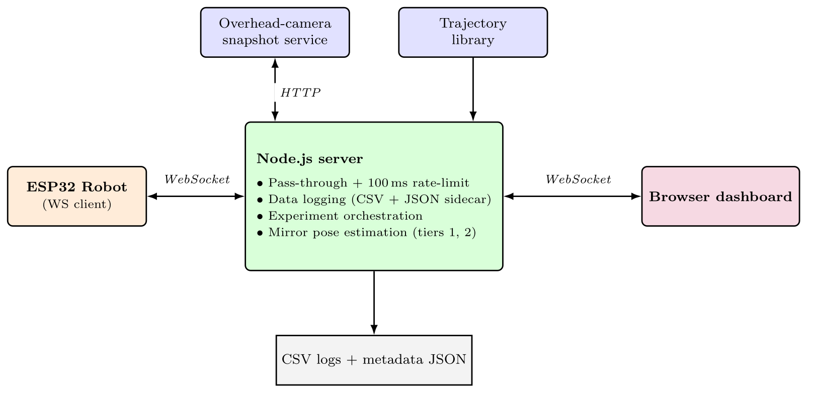

### Dashboard surfaces

<table>
<tr>
<td align="center">
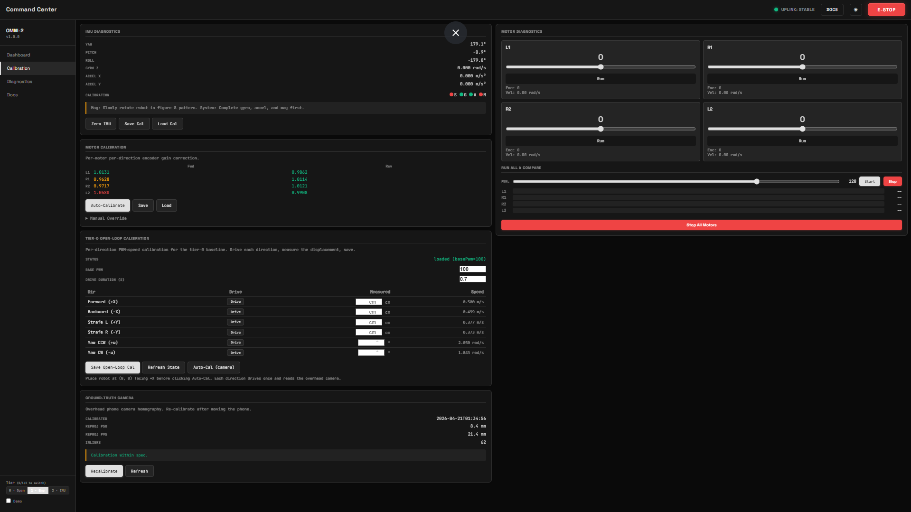<br>
<sub><b>Calibration page</b> — per-wheel uniformity chart, IMU calibration tile, latency / clock-sync diagnostics, E-STOP.</sub>
</td>
<td align="center">
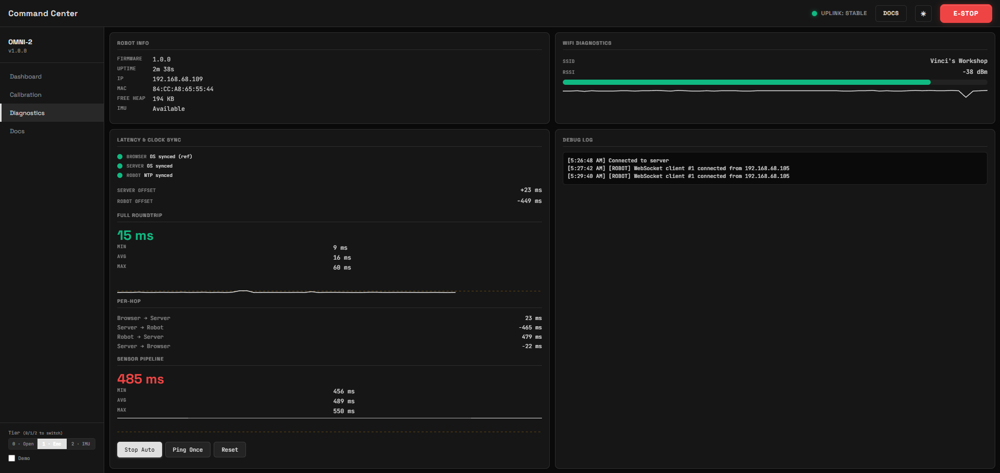<br>
<sub><b>Diagnostics</b> — live IMU readings, motor lockup detection, WiFi RSSI, per-hop latency sparklines.</sub>
</td>
</tr>
<tr>
<td align="center">
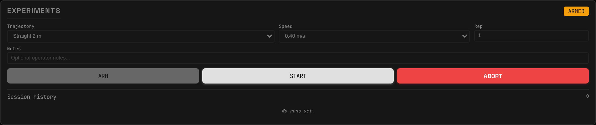<br>
<sub><b>Experiment runner</b> — arms a trajectory, supervises the firmware-level pause/resume contract, captures ground truth per run.</sub>
</td>
<td align="center">
<br>
<sub><b>Main dashboard</b> — joystick teleop, 2D map of the robot's estimated pose, telemetry tiles.</sub>
</td>
</tr>
</table>

### Running the server

```bash
cd server
npm install
npm start                       # production
npm run dev                     # auto-reload
```

The dashboard listens on `http://localhost:3000`. Override defaults by
creating `server/src/config.local.js` (gitignored):

```js
export const localConfig = {
    robot: { ip: 'robot.local' }
};
```

Tests:

```bash
cd server
npm test
```

~170 unit and integration tests across localization, web server,
data logging, trajectories, and the trajectory runner.

---

## Automated calibration

Low-cost DC motors with magnetic encoders exhibit per-unit gain
variation that defeats open-loop motion and skews closed-loop
transients. Open Omnibot ships a **fully automated, in-firmware
motor calibration routine** that the operator invokes from the
dashboard. The state machine sweeps each motor through a fixed
PWM grid (±100, ±160, ±220), measures the resulting wheel
velocity, and writes per-motor / per-direction feedforward gains
to non-volatile storage.

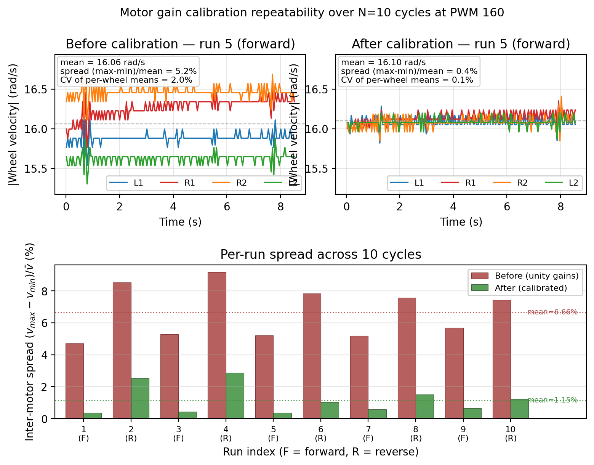

| Metric | Before calibration | After calibration | Improvement |
|---|---|---|---|
| Inter-wheel velocity spread @ PWM 160 (n=10) | 6.66 ± 1.62 % | 1.15 ± 0.90 % | **8.25×** |
| Straight-line drift over 2 m (n=10) | 22 cm / 11° | 2 cm / 2° | **~10×** |

The gain compensation is applied on the **feedforward PWM** side,
not on the encoder measurement side — applying it to measurements
distorts the forward-kinematics integration (this was a real bug
fixed on 2026-04-18; see `firmware/esp32-omni/ARCHITECTURE.md`).

Full procedure documented in
[`docs/architecture/11-motor-calibration.md`](docs/architecture/11-motor-calibration.md).

---

## Localization

Three tiers are documented under [`localization/`](localization/);
two are operational, one is reference theory only.

| Tier | Method | Status |
|---|---|---|
| **1** | Wheel-encoder dead reckoning | Operational. Drifts over time. |
| **2** | Complementary filter (encoders + IMU gyro) | Operational. Reduced heading drift. |
| **3** | EKF fusion with UWB ranges | **Reference theory only.** The UWB reader, EKF, and anchor handling were removed from the runtime on 2026-04-14 pending validation of Tiers 1 and 2. The math is published as a starting point for future work. |

Each tier has a markdown explainer plus a MATLAB reference
implementation under [`localization/matlab/`](localization/matlab/).

---

## Documentation

The repository ships with a manifest-driven user manual that the
server renders inside the dashboard's docs viewer at
`http://localhost:3000/docs`. The same files render fine on GitHub.

Highlights:

- [Getting started](docs/getting-started.md) — 30-minute walkthrough from unboxing to driving.
- [Calibration guide](docs/calibration.md) — IMU, encoder, and motor procedures.
- [Troubleshooting](docs/troubleshooting.md) — common failure modes.
- [Components reference](docs/hardware/00-components.md) — what each part does and why it was chosen.
- [Motor control architecture](docs/architecture/10-motor-control.md) — slew limiter, mecanum kinematics, feedforward + PID.
- [Motor calibration deep-dive](docs/architecture/11-motor-calibration.md) — state machine, war stories, gain normalisation.
- [Encoders](docs/architecture/12-encoders.md) — PCNT setup, overflow detection, glitch filter.
- [Diagnostics tooling](docs/architecture/40-diagnostics.md) — what each dashboard panel exists to catch.
- [Dead reckoning](docs/architecture/50-dead-reckoning.md) — encoder counts → world-frame pose.
- [Aegis design system](docs/aegis-design-system.md) — design tokens and extension guide for the UI.
- [API reference](docs/api-reference.md) — WebSocket protocol and HTTP endpoints.

---

## Repository structure

```
open-omnibot/
├── docs/                 — user-facing manual (rendered by the dashboard's docs viewer)
│   ├── architecture/     — firmware deep-dives
│   ├── hardware/         — component reference
│   ├── images/           — diagrams used by the manual
│   ├── manifest.json     — table of contents for the docs viewer
│   └── *.md
├── evaluation/
│   ├── scripts/          — experiment runners (Node) and analysis (Python)
│   ├── ground_truth/     — overhead-ArUco snapshot service + calibration
│   └── notebooks/        — placeholder for analysis notebooks
├── firmware/
│   ├── esp32-omni/       — main controller (PlatformIO project + native tests)
│   └── dwm1001-uwb/      — UWB tag/anchor (stub; not in active runtime)
├── hardware/             — BOM + pinout + CAD/PCB/wiring placeholders
├── localization/         — tier theory and MATLAB reference implementations
├── server/               — Node.js control server, dashboard, experiment runner
├── images/               — assets used by this README
├── CITATION.cff
├── CONTRIBUTING.md
├── LICENSE
└── README.md
```

---

## Getting started

The fastest path from clone to driving:

```bash
# 1. Clone
git clone https://github.com/samiul-hoque/open-omnibot.git
cd open-omnibot

# 2. Flash the firmware (USB the first time, OTA after)
cd firmware/esp32-omni
pio run -t upload

# 3. Start the control server
cd ../../server
npm install
npm start

# 4. Open http://localhost:3000 in a browser
```

A full walkthrough — wiring, mDNS hostname, IMU calibration,
first drive — lives in [`docs/getting-started.md`](docs/getting-started.md).

---

## Status and scope

This release is the **code + hardware + docs** subset of the project.

**What's here**
- Mechanical BOM and pinout reference.
- Firmware: 50 Hz cooperative control loop, per-wheel PID, motor
  calibration state machine, encoder overflow handling, OTA, native
  unit tests.
- Server: Node.js, WebSocket bridge, ~170 tests, browser dashboard,
  experiment runner with firmware-level pause/resume contract.
- Documentation: ~15 markdown files rendered by the dashboard's
  docs viewer.

**What's deferred to future releases**
- The UWB reader and the tier-3 EKF were removed from the runtime
  on 2026-04-14 and are not active. The reference math lives under
  `localization/`.
- The 602 MB overhead-camera snapshot dataset referenced by the
  ground-truth toolchain is being prepared for a separate Zenodo
  deposit; a DOI link will land here when available.
- Conference papers derived from this platform will be linked from
  this README when published.

---

## Citation

If Open Omnibot is useful in your work, please cite it. A
machine-readable [`CITATION.cff`](CITATION.cff) is included.

```bibtex
@software{hoque2026openomnibot,
  author  = {Hoque, Samiul},
  title   = {Open Omnibot: An Open-Source Mecanum Mobile-Robot Platform},
  year    = {2026},
  url     = {https://github.com/samiul-hoque/open-omnibot},
  license = {MIT},
  version = {1.0.0}
}
```

---

## License

MIT — see [`LICENSE`](LICENSE). Hardware designs, firmware, server,
and dashboard are all released under the same terms.

---

<div align="center">
<sub>Built for indoor mobile robotics research and teaching. Bug reports, hardware photos, and pull requests welcome.</sub>
</div>
