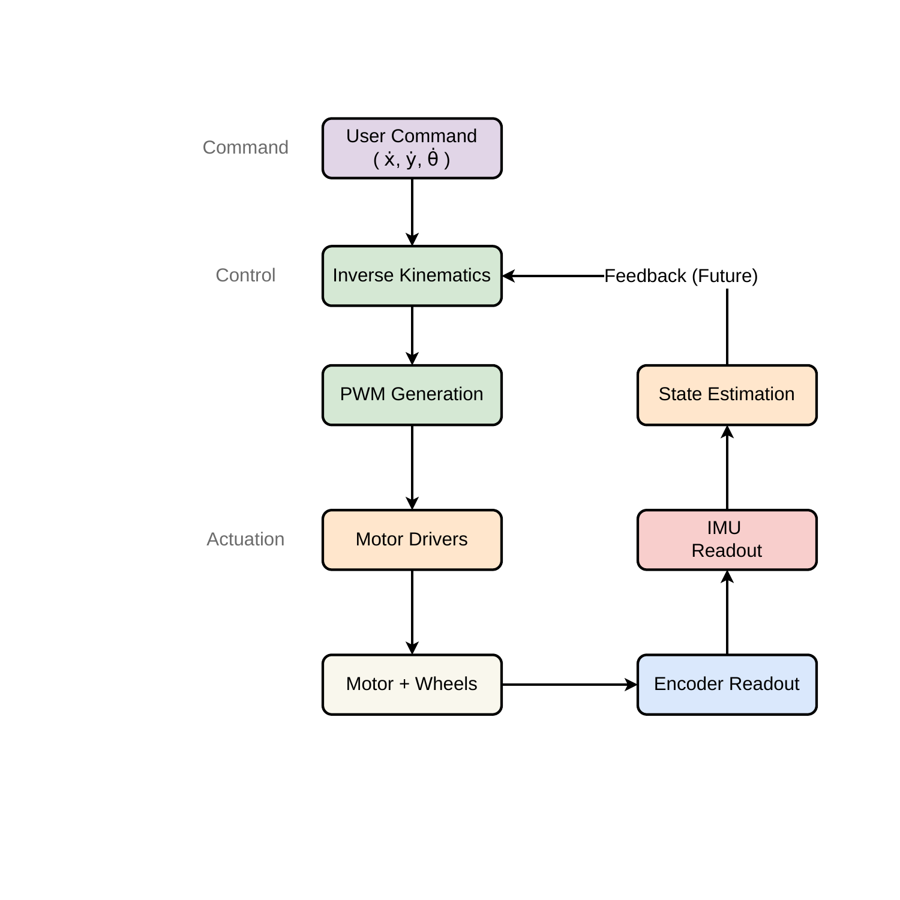
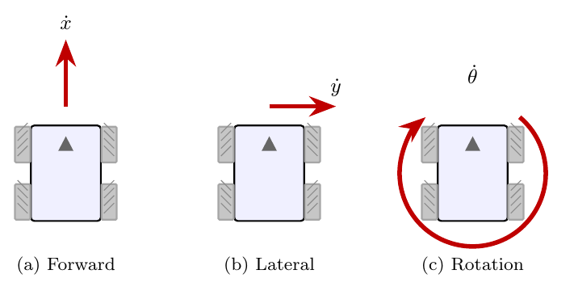

# Motor Control

## TL;DR

Four mecanum wheels driven by a feedforward + PID velocity loop, with a slew-rate limiter on every PWM write to protect the gearboxes from shock loads. Body-frame velocity commands `(vx, vy, ω)` are remapped (axis correction for physical mounting), passed through inverse kinematics, scaled if any wheel saturates, then per-wheel feedforward-plus-PID produces the final 8-bit PWM written through the LEDC peripheral and an MCP23017 GPIO expander.



## The problem (slew limiter)

Early prototypes broke gear teeth in the 42:1 metal gearboxes. Symptom: a tooth-skip "click" followed by one wheel spinning freely while the encoder kept reporting motion. Root cause: any time the PID slammed PWM from a large positive value to a large negative value in a single cycle, the inertia of the wheel against the now-reversed motor torque produced a mechanical shock the gear train couldn't absorb. Even an all-metal gearbox can shear or chip a tooth under that kind of impulsive reversal — the failure mode isn't fatigue, it's a single overload event. This happened most often during emergency-stop tests and during early PID tuning where high gains caused the loop to overshoot and reverse.

## The fix (slew limiter)

Every call to `setMotorSpeed()` clamps the PWM delta to `MOTOR_MAX_PWM_STEP = 15` per call. With the motor loop running at 50 Hz (20 ms period), full reversal from +255 to −255 takes ⌈510/15⌉ × 20 ms ≈ **340 ms** instead of being instantaneous. `stopAllMotors()` sets a `forceStop` flag that bypasses the ramp so the E-STOP path remains immediate.

Trade-off accepted: slightly less responsive direction reversal during normal driving. In practice this is invisible to a human operator and has eliminated all subsequent gear failures.

## How it works (slew limiter)

`firmware/esp32-omni/src/motors.cpp:67-103` — `setMotorSpeed()`:

```cpp
if (!forceStop) {
    int16_t delta = speed - lastPWM[motorIndex];
    if (delta > MOTOR_MAX_PWM_STEP) {
        speed = lastPWM[motorIndex] + MOTOR_MAX_PWM_STEP;
    } else if (delta < -MOTOR_MAX_PWM_STEP) {
        speed = lastPWM[motorIndex] - MOTOR_MAX_PWM_STEP;
    }
}
lastPWM[motorIndex] = speed;
```

`MOTOR_MAX_PWM_STEP` is defined in `config.h:112`. Tuning notes:
- Increasing the step makes reversals snappier but reintroduces gear stress; do not exceed ~25 without testing under load.
- Decreasing it makes the robot feel sluggish and starves the PID derivative term.

The `lastPWM[]` state is preserved across calls — there is no reset path. `stopAllMotors()` (`motors.cpp:109`) sets `forceStop = true`, calls `stopMotor()` for each wheel (which writes PWM = 0 immediately), then clears the flag. E-STOP latency is bounded by the I²C transaction time on the MCP23017 direction pins (~1 ms total).

## Mecanum kinematics


The mecanum wheel arrangement (rollers at 45°, four wheels) produces the relations below. The body frame is `vx` forward, `vy` left, `ω` CCW; wheel angular velocities are positive when the wheel rolls forward. The diagram above defines the chassis dimensions: `w` is the track width and `l` is the wheelbase, related to the firmware constants as `Lx = w/2` and `Ly = l/2`.

The three independent motion modes a mecanum drive can produce — forward, lateral strafe, and rotation — look like this:



Each mode requires a different combination of wheel speeds; the inverse kinematics equations below produce the right combination from a body-frame velocity command.

### Inverse kinematics — body → wheel speeds

`firmware/esp32-omni/src/mecanum.cpp:37-50`:

```
ω_L1 = (1/r) · ( vx + vy − (Lx + Ly)·ω )      // rear-left
ω_R1 = (1/r) · ( vx − vy + (Lx + Ly)·ω )      // rear-right
ω_R2 = (1/r) · ( vx + vy + (Lx + Ly)·ω )      // front-right
ω_L2 = (1/r) · ( vx − vy − (Lx + Ly)·ω )      // front-left
```

Constants from `config.h`:
- `r = WHEEL_RADIUS = 0.04 m` (80 mm wheel)
- `Lx = 0.1175 m` (half track width, 235 mm wheelbase)
- `Ly = 0.0953 m` (half wheelbase, 190.6 mm front-to-rear)
- `L_SUM = Lx + Ly = 0.2128 m`

The four equations are derived from each wheel's roller direction projecting the body-frame velocity onto the rolling axis. They are the standard form documented in any mecanum robotics reference; we use the form above because the sign convention matches the wheel labelling on the chassis.

### Forward kinematics — wheel speeds → body velocity

`mecanum.cpp:52-68`:

```
vx = (r/4)   · ( ω_L1 + ω_R1 + ω_R2 + ω_L2)
vy = (r/4)   · (−ω_L1 + ω_R1 − ω_R2 + ω_L2)
ω  = (r/(4L))· (−ω_L1 + ω_R1 + ω_R2 − ω_L2)
```

Used by the server's dead-reckoning loop (`server/src/localization/odometry.js`) — see `50-dead-reckoning.md` for how encoder counts become a pose update.

### Saturation

If any wheel target exceeds `MAX_WHEEL_SPEED = 8.0 rad/s` (`pid_controller.cpp:20`), all four targets are scaled by `MAX_WHEEL_SPEED / max(|ω_i|)`. This preserves the **direction** of the commanded body velocity at the expense of magnitude. If you only clamped per-wheel, the robot would curve unpredictably under saturation.

Implementation: `pid_controller.cpp:87-92`.

## Axis remap (the "this is not a bug" comment)

`pid_controller.cpp:64-69`:

```cpp
float ik_vx    = -vy;       // user strafe → IK forward
float ik_vy    = -omega;    // user rotation → IK lateral
float ik_omega = vx;        // user forward → IK rotation
```

The user-facing velocity command frame does **not** match the frame the inverse-kinematics equations were derived for. This was discovered during early field testing: commanding "forward" produced strafe, commanding "rotate" produced forward motion. Two fixes were on the table:

1. Re-wire the motors physically to match the textbook frame.
2. Apply a fixed remap in firmware.

We chose firmware because it's reversible, documentable, and survives chassis re-assembly. The remap is concentrated in one place; if anyone re-mounts the wheels in the future, they only need to update these three lines.

**Do not try to "fix" this remap by changing the IK equations** — they are correct for the physical wheel layout. The remap exists because the user/operator frame and the wheel frame don't agree.

## Feedforward + PID

`pid_controller.cpp:64-141` — `applyClosedLoopVelocity()`:

```
target_wheel_speeds = IK(remap(vx, vy, ω))
target_wheel_speeds = saturate(target_wheel_speeds, MAX_WHEEL_SPEED)

for each wheel:
    actual = (Δcounts × gain × 2π) / (CPR × dt) × −dir
    feedforward = wheelSpeedToPWM(target)            // linear: target → PWM
    correction  = computePID(error = target − actual)
    pwm = clamp(feedforward + correction, ±255)
```

Where:
- `gain` is the per-direction motor calibration factor (see `11-motor-calibration.md`)
- `CPR` = `COUNTS_PER_WHEEL_REV` = 1092 (`config.h:52`)
- `−dir` accounts for motors with inverted physical orientation (`MOTOR_*_DIR` in `config.h`)
- `wheelSpeedToPWM()` is a linear map: `pwm = (ω / MAX_WHEEL_SPEED) × 255` (`mecanum.cpp:70-81`)

### Why feedforward AND PID?

Pure PID had two problems:
1. **Steady-state lag.** The integral term took ~1 second to ramp to the right output, so commanded step changes had visible delay.
2. **Coupling.** All four wheels needed the same I gain to produce coordinated motion; if one wheel lagged, the robot curved.

Pure feedforward couldn't reject load disturbance — pushing against a wall, a tilted floor, or an under-charged battery all produced noticeable speed errors with no correction.

Combining them: feedforward provides the **expected** PWM for the commanded speed, PID corrects whatever error remains. The PID loop only has to push against the residual, so the gains can be smaller and more stable.

### PID gains

`config.h` (defaults applied in `pid_controller.cpp:52-62`):
- `Kp = 20.0` — fast error response
- `Ki = 25.0` — eliminates steady-state error within ~200 ms
- `Kd = 0.05` — small; mostly damps the slew-limiter ramp transitions

Anti-windup: integral is clamped to `±PID_INTEGRAL_MAX / Ki = ±200/25 = ±8 rad/s` worth of accumulated error (`pid_controller.cpp:36-38`).

### Integral persistence

The PID integral is **not** reset on every `cmd` — only on velocity timeout via `resetPIDControllers()`. This was deliberate: each motor has a slightly different friction load and learns its own bias in the integral term. Resetting per-command meant every restart had to relearn the bias and produced a visible jerk on takeoff. With persistence, repeated start/stop cycles feel smooth.

### Zero-target short circuit

`pid_controller.cpp:73-81`: when `vx = vy = ω = 0`, the function refreshes the encoder snapshot and writes 0 PWM directly without running the PID. This prevents the PID from oscillating around zero (trying to correct phantom errors caused by encoder noise at standstill) and keeps `pidLastCounts` fresh so the next non-zero command computes a sensible velocity.

## Tuning / configuration

Located in `firmware/esp32-omni/src/config.h`:

| Constant | Value | When to change |
|---|---|---|
| `MOTOR_MAX_PWM_STEP` | 15 | Only if changing gearbox; lower = safer, slower |
| `PWM_FREQ` | 1000 Hz | If you hear motor whine; some drivers like 20 kHz |
| `PWM_RESOLUTION` | 8 bit | Match driver capabilities |
| `PID_KP_DEFAULT` | 20.0 | If response is sluggish (raise) or oscillating (lower) |
| `PID_KI_DEFAULT` | 25.0 | Tune after Kp; high values can wind up despite the clamp |
| `PID_KD_DEFAULT` | 0.05 | Usually leave alone; raise only if Kp must be high |
| `PID_INTEGRAL_MAX` | 200 | The PWM-equivalent windup ceiling |
| `MAX_WHEEL_SPEED` | 8.0 rad/s | Hard upper bound on commanded wheel speed |

Tuning procedure:
1. Set `Ki = Kd = 0`. Raise `Kp` until the wheel responds quickly to step commands but doesn't oscillate.
2. Add `Ki` slowly until steady-state error is gone. If it overshoots, reduce.
3. Add `Kd` only if `Kp` had to be very high (>30) to get response.
4. Verify under load (push against a wall, drive on carpet) — feedforward alone shouldn't cause runaway.

## Known limitations

- **No current sensing.** A stalled motor will be commanded to full PWM by the PID until thermal protection in the driver kicks in. Future work: read motor current and clamp.
- **Slew limiter is per-motor, not coordinated.** All four motors ramp independently, so during a complex command the four wheels can desynchronize for ~340 ms. Visible only at the highest commanded speeds.
- **No model of motor electrical dynamics.** The feedforward assumes linear PWM-to-speed; this is approximate at low PWM where the motor can't overcome static friction. Below ~PWM 40, response is jumpy.
- **MCP23017 latency.** Direction pins are on an I²C expander, so a forward→reverse transition has an extra ~1 ms of I²C latency vs. native GPIO. Acceptable for our control rate.

## Source

- `firmware/esp32-omni/src/motors.cpp:67-103` — slew limiter, direction pins
- `firmware/esp32-omni/src/motors.cpp:109-115` — emergency stop bypass
- `firmware/esp32-omni/src/mecanum.cpp:37-50` — inverse kinematics
- `firmware/esp32-omni/src/mecanum.cpp:52-68` — forward kinematics
- `firmware/esp32-omni/src/pid_controller.cpp:30-46` — PID computation
- `firmware/esp32-omni/src/pid_controller.cpp:64-141` — full control pipeline
- `firmware/esp32-omni/src/config.h:74-141` — pin definitions, PID defaults, max PWM step
- Related: `11-motor-calibration.md`, `12-encoders.md`, `50-dead-reckoning.md`
