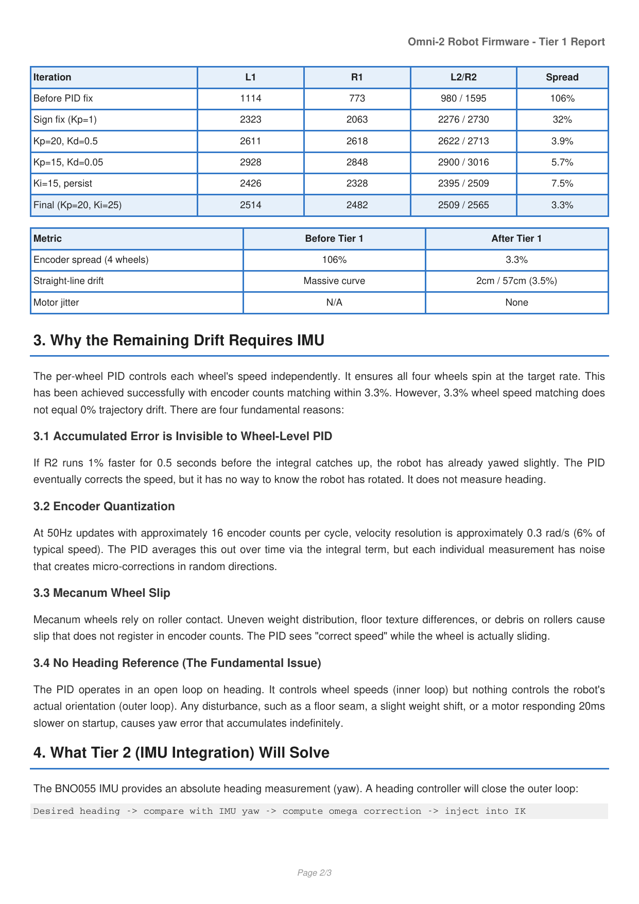

# Motor Calibration

## TL;DR

Each of the four gearmotors converts PWM into wheel rotation slightly differently — same PWM, different speed. A built-in routine drives all four motors through 6 steady-state PWM levels (3 magnitudes × 2 directions), counts encoder ticks, and computes 8 gain factors (per motor, per direction) that normalize each wheel back to the group mean. The gains are then applied at every encoder read so the rest of the firmware sees a "fair" world. Result: encoder spread on the same command went from **106% to 3.3%**, and straight-line dead reckoning drift dropped from "the robot turns visibly within a meter" to ~3.5% over 57 cm.

## The problem

Tier 1 dead reckoning was the first localization mode we got working. It uses encoder counts plus mecanum forward kinematics to integrate body displacement (`server/src/localization/odometry.js`). On paper this should produce a straight line when commanded straight forward.

In practice the robot **curved noticeably** during straight commands. Symptoms:
- A "go forward 2 m" command landed the robot 30–50 cm to one side of the target.
- The on-screen trail in the dashboard showed a smooth arc, not a straight line.
- Reversing direction made the arc go the **other** way — not a fixed mechanical bias.

We logged raw encoder velocities for the four wheels under identical commands and found the spread was ~106% of the mean. One wheel at PWM 200 was producing ~12 counts/cycle while another at the same PWM was producing ~24. The mecanum forward-kinematics equations average the four wheel speeds, so any imbalance shows up as spurious body velocity that the integrator faithfully accumulates.

### Why the motors disagreed

Two independent causes contributed:

1. **Manufacturing variance in the gearboxes.** These are mass-produced 42:1 metal gearheads; even with metal gears the tolerances on tooth backlash, lubrication, and bearing fit are loose. Two nominally identical motors can produce 20% different output speed at the same PWM.
2. **Directional asymmetry per motor.** A single motor doesn't even produce the same speed forward vs. reverse. Static friction and tooth-engagement angle differ, so the same |PWM| gives different |speed| in each direction.

So the correction needed two dimensions: **per motor** (4 values) **and per direction** (×2) = **8 gain factors**.

## The fix

Per-motor per-direction gain factors stored in NVS, applied wherever encoder counts are converted to physical units. Computed automatically by a state machine that the diagnostics UI can trigger.

After calibration:
- Encoder spread under uniform PWM: **3.3%** (vs. 106% before).
- Straight-line drift over 57 cm of travel: **~3.5%** (~2 cm).

These numbers are recorded in `firmware/esp32-omni/CLAUDE.md` and verified after every gearbox swap. The table below — from the Tier 1 firmware report — shows the progression of encoder spread across the firmware tuning journey, ending with the post-calibration "After Tier 1" row:



Each row is the total encoder count produced by each wheel during the same fixed forward command. The top row ("Before PID fix") is the open-loop baseline where the 106% spread comes from — the motors are so mismatched that the slowest wheel produces barely half the counts of the fastest. Each subsequent row is a tuning iteration: sign-fixed PID, gain-tuned PID, integral-enabled PID, and finally the post-calibration state in the "After Tier 1" row where the spread is clamped to **3.3%**. The same improvement visible in the table is what makes dead reckoning usable: see `50-dead-reckoning.md` for how that residual spread maps to straight-line drift.

## How the algorithm works

`firmware/esp32-omni/src/motor_calibration.cpp` implements a 4-state machine driven from the main loop at 50 Hz.

### State machine

```
                    ┌───────────────┐
                    │   CAL_IDLE    │
                    └──────┬────────┘
                           │ start_motor_cal
                           ▼
                    ┌───────────────┐
              ┌────►│ CAL_SETTLING  │  ← 300 ms wait, motors off
              │     └──────┬────────┘
              │            │ elapsed ≥ MOTOR_CAL_SETTLE_MS
              │            ▼
              │     ┌───────────────┐
              │     │ CAL_RAMPING   │  ← 400 ms, slew limiter ramps to PWM
              │     └──────┬────────┘
              │            │ elapsed ≥ MOTOR_CAL_RAMP_MS
              │            ▼
              │     ┌───────────────┐
              │     │ CAL_MEASURING │  ← 2000 ms, count encoder ticks
              │     └──────┬────────┘
              │            │ elapsed ≥ MOTOR_CAL_STEP_DURATION_MS
              │            │
              │   step++   │
              └────────────┤
                           │ all 6 steps done
                           ▼
                    ┌───────────────┐
                    │ CAL_COMPLETE  │  ← compute gains, save, broadcast
                    └──────┬────────┘
                           │
                           ▼
                       CAL_IDLE
```

Each "step" is one (PWM level, direction) pair. With 3 levels × 2 directions = **6 steps total**, and all four motors run together in each step, the whole calibration takes:

```
6 × (300 ms settle + 400 ms ramp + 2000 ms measure) ≈ 16 seconds
```

(`MOTOR_CAL_SETTLE_MS`, `MOTOR_CAL_RAMP_MS`, `MOTOR_CAL_STEP_DURATION_MS` in `motor_calibration.h:8-10`.)

### PWM levels

`motor_calibration.cpp:18`: `const int pwmLevels[3] = {100, 160, 220};`

Choices:
- **100** is just above the static-friction threshold; below this some motors don't move at all.
- **220** is below the saturation region where the driver clips; above this the encoder rate is non-linear.
- **160** is the midpoint, used to detect any non-linear gain behaviour (in practice it's been linear enough that we don't actually fit a curve — the three measurements are summed into one accumulator per direction).

### Why we measure all four motors at once

Calibrating one motor at a time would require knowing the absolute "true" speed of that motor (i.e. you'd need a tachometer). We don't have one. By running all four together at the same PWM, the **group mean** becomes the reference, and each motor is measured **relative** to the group. We don't need an absolute scale — we only need the four wheels to agree with each other so the forward-kinematics average doesn't produce bogus body velocity.

This is why the diagnostics UI calls this the "uniformity test": we're correcting *relative* mismatch, not absolute speed.

### Why a separate ramp phase

The slew limiter (`10-motor-control.md`) means PWM doesn't reach the target instantly — it ramps over ~290 ms. If we measured during the ramp, the slowest part of the ramp would be over-represented in the count. So we wait `MOTOR_CAL_RAMP_MS = 400 ms` for PWM to reach target, **then** snapshot the encoder count, **then** measure for 2 seconds at steady state.

`motor_calibration.cpp:116-130` — `CAL_RAMPING` keeps writing the target PWM each cycle so the slew limiter actually progresses; if you stop writing, `lastPWM` stays put.

### Why a settle phase

Between steps, motors need to spin down. The settle period is short (300 ms) because we're going to PWM 0 before the next step, but it prevents the new step's measurement from being polluted by leftover momentum from the previous direction.

### Why per-direction is computed by sign of delta

`motor_calibration.cpp:141-148`:

```cpp
int32_t delta = getEncoderCount(i) - calStartCounts[i];
if (delta >= 0) {
    calAccumFwd[i] += delta;
} else {
    calAccumRev[i] += (-delta);
}
```

This **must** match how the gain is selected at runtime, because the calibration is correcting whatever the runtime path measures. The runtime path uses the same condition:
- `sensors.cpp:144-145` (encoder broadcast read)
- `pid_controller.cpp:115` (PID inner loop)
- `server/src/localization/odometry.js:69-72` (server-side dead reckoning)

If you ever change the rule (e.g. switch to "forward = commanded direction"), you must change all four sites or the gains will be applied to the wrong direction half the time.

### Gain computation

`motor_calibration.cpp:164-194` — the `CAL_COMPLETE` block:

```cpp
float fwdMean = (calAccumFwd[0] + calAccumFwd[1] + calAccumFwd[2] + calAccumFwd[3]) / 4.0f;
float revMean = (calAccumRev[0] + calAccumRev[1] + calAccumRev[2] + calAccumRev[3]) / 4.0f;

for (int i = 0; i < 4; i++) {
    gainsFwd[i] = fwdMean / (float)calAccumFwd[i];
    gainsRev[i] = revMean / (float)calAccumRev[i];
}
```

A motor that ran *fast* (high accumulator) gets a gain **< 1**, scaling its reported counts down to match the group. A motor that ran *slow* (low accumulator) gets a gain **> 1**, scaling its counts up. The geometric centre of the result is 1.0, so applying the gains doesn't change the average — only the distribution.

There's a sanity check: if `fwdMean` or `revMean` is < 100 counts, something's wrong (one or more motors didn't actually move). The routine reports failure and resets gains to 1.0 instead of dividing by a noisy near-zero accumulator.

### Application sites

The gains are loaded into a `motorGainFwd[4]` / `motorGainRev[4]` pair held in `sensors.cpp`. They are applied:

| Site | Purpose |
|---|---|
| `sensors.cpp:144-148` (`readEncoders`) | Per-tick wheel velocity broadcast to the server |
| `pid_controller.cpp:110-118` (`applyClosedLoopVelocity`) | PID measured-velocity feedback |
| `server/src/localization/odometry.js:69-72` (`update`) | Dead-reckoning displacement integration |

The gain is queried at the moment the delta is read; the **sign of the delta** determines which gain to use, not the commanded direction. This is intentional — it correctly handles the case where the motor is being driven forward but actually rolled backward (e.g. on a slope with the brakes off).

## NVS persistence

Saved/loaded via the ESP32 `Preferences` API in namespace `motor_cal`, keys `gf_0..3` (forward) and `gr_0..3` (reverse). Auto-loaded on boot via `autoLoadMotorCalibration()` so the robot wakes up with the correct gains.

The web UI exposes save/load/reset buttons because:
- **Save** is automatic at the end of a successful calibration run, but a manual save lets you stash a known-good baseline before experimenting.
- **Load** lets you revert if a fresh calibration produced bad numbers (e.g. the robot was on a slippery surface).
- **Reset** restores `1.0, 1.0, 1.0, 1.0` for each direction — useful when diagnosing whether the gains themselves are causing a behavior.

## When to recalibrate

- After replacing a motor or gearbox.
- After a hard impact that may have damaged a gear.
- If the straight-line drift suddenly worsens.
- On a different floor surface? **No** — gains correct mechanical mismatch, not friction. They're transferable across surfaces.
- After a battery change? **No** — the calibration is normalised to the group mean, so even if all four motors are 20% slower on a low battery, the *ratios* are unchanged.

## Known limitations

- **No load test.** Calibration runs with the wheels free-spinning (robot on a stand or driving in open space). Under load (a heavy payload, climbing a ramp) the gains may not be optimal because the friction-vs-motor torque curve changes.
- **Fixed PWM levels.** The 100/160/220 levels are hard-coded. Most useful operating range is 80–255; if your robot regularly operates near saturation, you'd want to add a level at ~250.
- **Single linear gain per direction.** We don't fit a polynomial curve. If a motor is non-linear (e.g. dead zone at low PWM, saturation at high PWM), the gain will be a compromise across the three measured PWMs. So far this has been good enough.
- **No timing dependence.** We treat the gain as constant in time. If a gear wears or grease degrades over weeks, you'll need to recalibrate manually — there's no drift detection.
- **Wheels must be free.** If the robot is against a wall, the wheel that's blocked will accumulate near-zero counts, get a huge gain, and then over-correct on the next normal drive. The sanity check (`fwdMean > 100`) catches the gross failure but not subtle interference.

## Source

- `firmware/esp32-omni/src/motor_calibration.cpp:54-81` — `startMotorCalibration()`
- `firmware/esp32-omni/src/motor_calibration.cpp:87-199` — state machine
- `firmware/esp32-omni/src/motor_calibration.cpp:164-194` — gain computation
- `firmware/esp32-omni/src/motor_calibration.h:7-10` — timing constants
- `firmware/esp32-omni/src/sensors.cpp:265-281` — `setMotorGains` / `getMotorGains`
- `firmware/esp32-omni/src/sensors.cpp:131-156` — gain application in `readEncoders`
- `firmware/esp32-omni/src/pid_controller.cpp:110-118` — gain application in PID feedback
- `server/src/localization/odometry.js:65-72` — gain application in dead reckoning
- Related: `10-motor-control.md`, `40-diagnostics.md`, `50-dead-reckoning.md`
