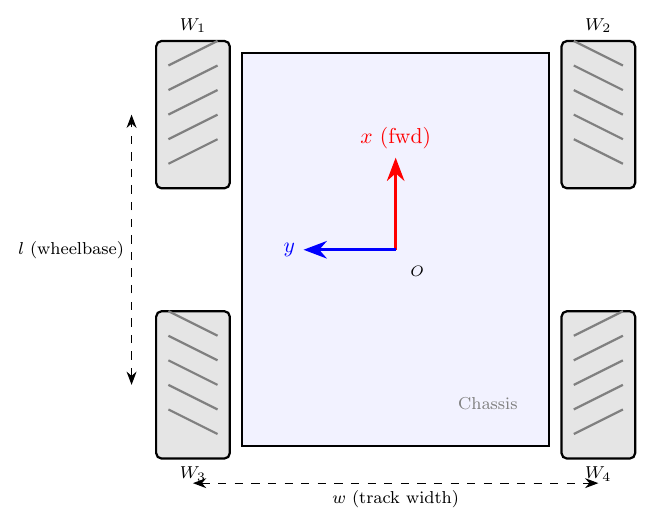

# Dead Reckoning (Tier 1 Odometry)

## TL;DR

Encoder counts → wheel displacements → mecanum forward kinematics → body-frame displacement → world-frame pose update. Runs server-side at the broadcast rate (50 Hz). Uses **midpoint integration** for the body-to-world rotation to reduce error during turns, plus a **rotation-noise heuristic** that suppresses tiny spurious translations during pure rotation. Drifts intentionally — that's the whole point of "Tier 1": it's the baseline against which all the fancier localization tiers (complementary filter, EKF) are measured. After motor calibration, current drift is ~3.5% over 57 cm of straight-line travel.

## Why this is server-side, not firmware-side

The robot publishes raw encoder counts; the server integrates them into a pose. Two reasons:

1. **The server is the source of truth for state.** Multiple clients (browser dashboards, logging, future autonomy) need a consistent view of pose. If the firmware kept its own pose state, every reset, restart, or OTA flash would lose it; if the firmware *and* server both kept it, they'd diverge. Single state holder.
2. **Algorithms are easier to iterate in JavaScript.** The complementary filter, EKF, and any future fusion code all live next to the dead-reckoning module so they can share kinematics and pose state. Changing the firmware means flashing the robot; changing the server means a file save.

The firmware's job is to make the encoder counts as accurate as possible (overflow handling, glitch filtering, gain correction). The server's job is to turn those counts into pose.

## The algorithm

`server/src/localization/odometry.js` — `Odometry.update(sensorData)`

```
For each new sensor packet:

  1. Apply encoder mapping → physical [L1, R1, R2, L2] order
  2. Compute deltaCounts[i] = encoders[i] − prevEncoders[i]
  3. Apply per-direction gain: dWheel_i = deltaCounts × gain × metersPerCount
  4. Mecanum forward kinematics on dWheel → (dx_body, dy_body, dθ)
  5. Apply rotation-noise heuristic (suppress small translations during turns)
  6. Rotate (dx_body, dy_body) into world frame using midpoint angle
  7. Accumulate: x += dx_world, y += dy_world, θ += dθ
  8. Normalize θ to [−π, π]
  9. Track total distance (for stats)
  10. Save current encoders as prevEncoders
```

Most of this is standard mecanum dead reckoning. Two parts deserve a closer look: the **midpoint integration** and the **rotation-noise heuristic**.

### Step 4: Mecanum forward kinematics for displacements



The same forward kinematics from `10-motor-control.md`, but applied to **displacements** (m) rather than velocities (m/s):

```js
const omegaL1 = dL1 / r;  // dWheel in metres → angle at wheel in radians
const omegaR1 = dR1 / r;
const omegaR2 = dR2 / r;
const omegaL2 = dL2 / r;

let dx_robot = (r / 4) * ( omegaL1 + omegaR1 + omegaR2 + omegaL2);
let dy_robot = (r / 4) * (-omegaL1 + omegaR1 - omegaR2 + omegaL2);
const dtheta = (r / (4 * L)) * (-omegaL1 + omegaR1 + omegaR2 - omegaL2);
```

This is the discrete-time form of the forward kinematics (since velocity × dt = displacement and the dt cancels out of the four equations). It is an **approximation** that assumes:
- The body velocity is constant over one sample interval (20 ms), and
- The robot rotates and translates simultaneously rather than sequentially.

For a mecanum robot at typical speeds (≤0.5 m/s) and a 20 ms sample, the approximation error per step is well below 1 mm. Long-term drift accumulates from other sources (wheel slip, gain mismatch, mechanical asymmetry), not from this discretization.

`server/src/localization/odometry.js:74-91`.

### Step 5: Rotation-noise heuristic

`odometry.js:93-107`:

```js
const rotationMagnitude = Math.abs(dtheta);
const translationMagnitude = Math.sqrt(dx_robot*dx_robot + dy_robot*dy_robot);

if (rotationMagnitude > 0.002) {
    const ratio = translationMagnitude / rotationMagnitude;
    if (ratio < 0.15) {
        dx_robot *= 0.2;
        dy_robot *= 0.2;
    }
}
```

**The problem:** when the robot rotates in place, all four wheels should produce equal-and-opposite contributions to the kinematics so that `dx_body = dy_body = 0`. In practice, the omni rollers slip slightly differently on each wheel and the four contributions don't perfectly cancel. The leftover is a tiny phantom translation per sample. Over many rotations the phantom translations accumulate into visible drift even though the robot hasn't actually translated.

**The fix:** when rotation is significant (`|dθ| > 0.002 rad` per sample) **and** the translation magnitude is small relative to rotation (`|dx,dy| / |dθ| < 0.15`), scale the translation down to 20% of the computed value. The thresholds were tuned empirically: too aggressive and pure-translation moves get suppressed too; too lax and the drift remains.

This is an unsatisfying hack — a properly filtered approach would model the wheel-slip noise as a covariance term and let the EKF handle it. But Tier 1 deliberately avoids fancy filtering, and this heuristic recovers most of the visible drift improvement at the cost of ~3 lines of code. It's a known trade-off documented here so future work doesn't accidentally remove it.

### Step 6: Midpoint integration for the body-to-world rotation

`odometry.js:109-116`:

```js
const midTheta = this.theta + dtheta / 2;
const cos_t = Math.cos(midTheta);
const sin_t = Math.sin(midTheta);

const dx_world = dx_robot * cos_t - dy_robot * sin_t;
const dy_world = dx_robot * sin_t + dy_robot * cos_t;
```

The naive thing would be to rotate `(dx_body, dy_body)` by the **starting** orientation `θ`. That works if the robot moves in a straight line (or doesn't rotate during the sample), but during a turn the robot's orientation changes mid-step. Using θ as the rotation introduces a per-step error proportional to `|dθ| × |translation|`.

The midpoint trick uses `θ + dθ/2`: the orientation halfway through the sample. This is the standard second-order correction for rigid-body integration over a small time step and reduces the curvature error to second order in `dθ`. For our 20 ms sample interval and typical rotation rates (~1 rad/s during a fast turn), the per-step improvement is modest (~0.1 mm) but it accumulates over long trajectories.

The approximation becomes wrong if `dθ` is very large per sample (>0.5 rad), but at our 50 Hz rate that would require >25 rad/s = >4 revolutions per second, far above the physical limit.

## Where the gain correction fits

The per-direction motor gain (see `11-motor-calibration.md`) is applied at step 3, **before** the kinematics:

```js
const dL1 = deltaL1 * (deltaL1 >= 0 ? gf[0] : gr[0]) * mpc;
```

Where `gf[]` / `gr[]` come from `config.physical.motorGainsFwd` / `motorGainsRev`, populated by `get_info` from the firmware. The selection rule (sign of delta) **must** match the rule used in the firmware-side gain application (`sensors.cpp:144-148`, `pid_controller.cpp:115`) and in the calibration accumulator (`motor_calibration.cpp:141-148`). All four sites use the same condition; if you change one, change them all.

This is the link between motor calibration and dead-reckoning quality: better gains → tighter agreement between the four wheel speeds → smaller systematic error in the forward kinematics average → less drift.

## Why this drifts (and that's OK)

Tier 1 has **no absolute position reference**. Every error source compounds:

| Source | Per-step | After 1 m of travel |
|---|---|---|
| Encoder quantization (1 count = 0.23 mm) | <1 mm | <5 mm |
| Wheel radius mismatch (manufacturing) | ~0.3% | ~3 mm |
| Floor texture / wheel slip | varies | 5–20 mm |
| Mecanum roller imperfection | varies | 5–15 mm |
| Gain calibration residual (3.3% spread) | ~3% | ~30 mm |
| Yaw error from turning (compounds) | small | up to 30° over 10 m |

The published "~3.5% over 57 cm" figure is the post-calibration straight-line drift. That's deliberately the worst-case test (no rotation, so all the error is translational). Real trajectories with mixed motion accumulate yaw error too.

This is **the whole point** of Tier 1. It's the baseline. Every other localization tier is measured against it: Tier 2 (complementary filter with IMU) reduces the yaw error; Tier 3 (EKF with UWB) bounds the position error against absolute anchors. If you want to know how much value the IMU is adding, you compare Tier 2's drift against Tier 1's drift on the same dataset.

See `localization/tier1-odometry.md` for the original derivation; the full error analysis lives in the project's underlying undergraduate thesis (linked from the project page when archived).

## Tuning / configuration

In `server/src/config.js` under `physical`:

| Constant | Value | Notes |
|---|---|---|
| `wheelRadius` | 0.04 m | Must match firmware `WHEEL_RADIUS` |
| `lSum` | 0.2128 m | Lx + Ly; must match firmware `L_SUM` |
| `metersPerCount` | ~2.3e-4 m | Derived from wheel circumference / `COUNTS_PER_WHEEL_REV` |
| `encoderMapping` | `[0, 1, 3, 2]` | Index swap to match firmware wire order |
| `encoderSigns` | `[+1, +1, -1, -1]` | Per-wheel sign correction |
| `motorGainsFwd` / `motorGainsRev` | populated from `get_info` | Live values from firmware NVS |

In `odometry.js` (hard-coded):

| Constant | Value | Notes |
|---|---|---|
| Rotation threshold | 0.002 rad/sample | Below this, no rotation-noise suppression |
| Translation/rotation ratio | 0.15 | Below this, the translation is treated as noise |
| Translation suppression factor | 0.2 | How much to scale the translation when suppressed |

The two ratios above were tuned empirically. If you change them, re-verify against a known straight-line and a known pure-rotation maneuver.

## Known limitations

- **No noise model.** Tier 1 returns a single pose, not a pose-with-uncertainty. The EKF fixes this; Tier 1 deliberately doesn't.
- **Yaw error grows unbounded.** Without an external heading reference, the heading is integral of `dθ` and any per-step bias accumulates. A 1°/m error becomes 360° after walking around a small lab.
- **Rotation-noise heuristic is a hack.** It's a fixed scale on a fixed condition. A motor with unusually slippy rollers might produce real translation that the heuristic suppresses, or a motor with stiff rollers might produce phantom translation that slips below the threshold.
- **No initialization from UWB.** Tier 1 starts at `(0, 0, 0)` and accumulates from there. If you want to start at a known absolute position you have to call `setPosition()` or `reset()` manually. The `initPoseFromUwb` button in the dashboard does this for you when UWB is connected.
- **Wheel slip detection is implicit.** If the robot is held in place but commanded to drive, the encoders still tick (motors are spinning) and the pose accumulates as if the robot moved. There is no way for Tier 1 to know it was stuck. The IMU layer (Tier 2) can detect this via accelerometer disagreement.

## Source

- `server/src/localization/odometry.js:39-134` — `Odometry.update()` main loop
- `server/src/localization/odometry.js:65-72` — gain application
- `server/src/localization/odometry.js:74-91` — discrete forward kinematics
- `server/src/localization/odometry.js:93-107` — rotation-noise heuristic
- `server/src/localization/odometry.js:109-116` — midpoint integration
- `firmware/esp32-omni/src/mecanum.cpp:52-68` — same kinematics, firmware reference (used for forward-kinematics derivation; firmware itself doesn't run this code at runtime)
- `localization/tier1-odometry.md` — algorithm theory and derivation
- Related: `10-motor-control.md`, `11-motor-calibration.md`, `12-encoders.md`
