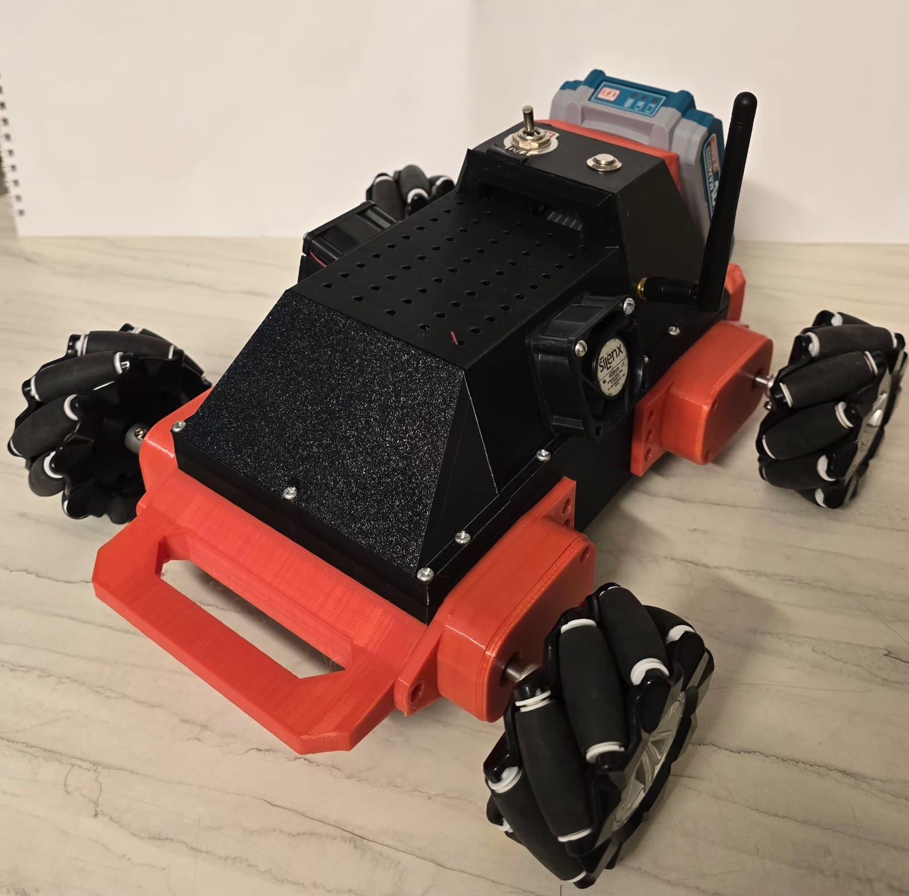
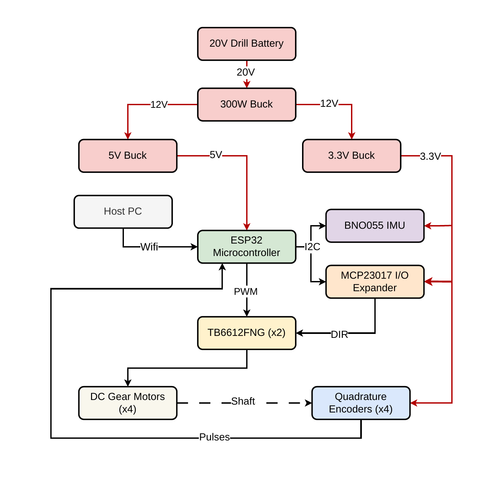
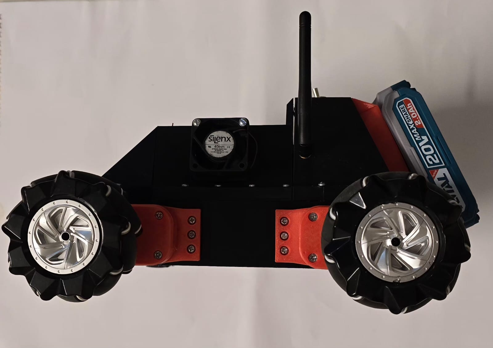
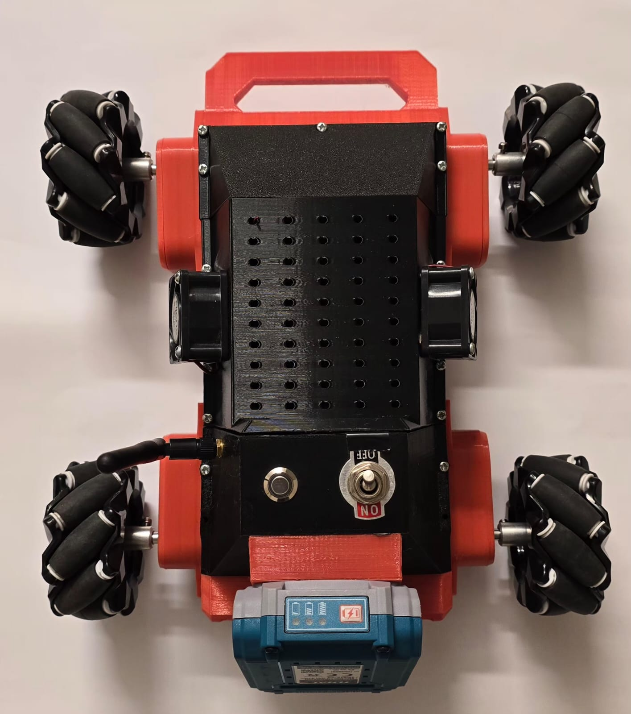

# Components



This is the user-facing reference for what's physically inside the robot. Each entry says **what the part does**, **how it connects**, **why we chose it**, and **what could replace it**. The authoritative pin assignments live in [`firmware/esp32-omni/src/config.h`](../../firmware/esp32-omni/src/config.h); this doc is kept in sync but the source code is the tiebreaker.

## Design intent vs built prototype

The chassis was designed in CAD before any parts were ordered. The assembled robot matches the CAD closely — the only visible departures are the antenna (not modelled in CAD), the cooling fan (added after thermal testing, see the power section), and cable routing through the top-deck perforations.

<div class="docs-gallery docs-gallery-2col">
  <figure class="docs-figure">
    
    <figcaption>CAD — 3/4 view (design intent)</figcaption>
  </figure>
  <figure class="docs-figure">
    
    <figcaption>Built — 3/4 view (prototype)</figcaption>
  </figure>
  <figure class="docs-figure">
    
    <figcaption>CAD — top view</figcaption>
  </figure>
  <figure class="docs-figure">
    
    <figcaption>Built — top view</figcaption>
  </figure>
</div>

For an at-a-glance parts list with quantities, see [`hardware/bom.csv`](../../hardware/bom.csv).

## System block diagram



The diagram shows the full hardware stack: a 20 V drill battery feeds a 300 W buck which steps down to 12 V (motor rail) and feeds two further bucks for 5 V and 3.3 V (logic rails). The ESP32 talks to the host PC over WiFi, drives two TB6612FNG motor drivers via PWM, and reads back from quadrature encoders + a BNO055 IMU + an MCP23017 GPIO expander over I²C.

---

## Compute

### ESP32 — MH ET LIVE MiniKit

- **Role:** Real-time controller. Runs the motor PID loop at 50 Hz, reads encoders and IMU, hosts the WebSocket server that the PC dashboard connects to, handles OTA firmware updates.
- **Interface:** USB serial (programming), WiFi (control), I²C (sensors and GPIO expander).
- **Key pins used:** see [hardware/README.md](../../hardware/README.md#wiring--pinout).
- **Why this part:** Compact form factor (fits the chassis), integrated WiFi (no extra radio module), enough hardware peripherals to do everything natively — four LEDC PWM channels for motors, four PCNT units for encoders, hardware I²C for sensors. The Arduino-via-PlatformIO toolchain made early prototyping fast.
- **Substitutes:** Any ESP32-WROOM-based board would work as long as it exposes the GPIOs we use (14, 18, 19, 21, 22, 25, 26, 27, 32, 33, 34, 35, 36, 39). The ESP32-S3 would work but requires a code port for the PCNT API differences.
- **Datasheet/source:** TODO add link

### MCP23017 — I²C GPIO expander @ `0x20`

- **Role:** Provides 10 of the GPIO pins we need for motor control: 8 direction-control pins (IN1/IN2 per motor) plus 2 standby pins (one per pair of motors).
- **Interface:** I²C, sharing the bus with the BNO055.
- **Why this part:** The ESP32 has plenty of GPIO in absolute terms but a lot of its pins have constraints (input-only, strapping, ADC2 conflicts with WiFi, etc.). We need to keep the four PCNT-capable pins for encoders, four LEDC-capable pins for PWM, and a clean I²C bus. Putting the slow-changing direction pins on an expander frees the constrained ESP32 GPIOs for the things that **must** be on the MCU directly. The trade-off is one I²C transaction per direction change (~1 ms latency) — invisible at our control rate.
- **Substitutes:** PCF8575 (also 16-bit I²C expander, different protocol), or a different MCU package with more native GPIO. SPI variants (MCP23S17) would shave latency but the I²C version was on hand.
- **Datasheet/source:** Microchip MCP23017

---

## Drivetrain

### Gearmotors (×4) — DC + 42:1 metal gearbox + quadrature encoder

- **Role:** Convert PWM into wheel rotation. Each motor has a built-in optical or magnetic quadrature encoder on the motor shaft (i.e. *before* the gearbox, so 13 PPR × 2× quadrature × 42:1 = **1092 counts per wheel revolution**).
- **Interface:** Motor leads to driver outputs; encoder A/B to ESP32 PCNT inputs; encoder VCC to 3.3 V or 5 V depending on encoder type.
- **Why metal gears:** Early experiments with PID gain tuning produced PWM reversals violent enough to chip a tooth on a single overload event. Metal gears are more robust against chipping but are not invincible — see [`docs/architecture/10-motor-control.md`](../architecture/10-motor-control.md#the-problem-slew-limiter) for the failure history. The slew-rate limiter in firmware exists to prevent the same impulse from happening again.
- **Why encoders:** Closed-loop velocity control needs measured wheel speed; dead reckoning needs counted wheel rotation. Without encoders neither would work.
- **Why 42:1:** Trade-off between top speed and torque. At our rated voltage and 42:1, top wheel speed is ~8 rad/s (limited in firmware by `MAX_WHEEL_SPEED = 8.0`), which gives ~32 cm/s body speed — fast enough to be useful, slow enough that the control loop stays stable.
- **Specific model:** TODO confirm part number. The current build uses an off-the-shelf "DC + metal-gearbox + encoder" assembly; any similar gearmotor with the same form factor and 42:1 ratio should work after recalibration.
- **Substitutes:** N20 metal gearmotors (smaller, weaker), TT motors with metal gears (larger, slower). Any change requires re-running motor calibration and possibly retuning PID.
- **Related docs:** [`docs/architecture/10-motor-control.md`](../architecture/10-motor-control.md), [`docs/architecture/11-motor-calibration.md`](../architecture/11-motor-calibration.md), [`docs/architecture/12-encoders.md`](../architecture/12-encoders.md).

### Mecanum wheels (×4) — 80 mm

- **Role:** Provide omnidirectional motion. Each wheel has rollers angled at 45° around its rim; the four wheels in the standard mecanum configuration produce body-frame motion `(vx, vy, ω)` from independently driven wheel speeds.
- **Interface:** Mechanical (mounted to motor output shafts).
- **Specs:** 80 mm diameter (radius 0.04 m, used as `WHEEL_RADIUS` in `config.h`). Two left-handed wheels (rollers angled `\`) and two right-handed wheels (rollers angled `/`); they are placed in opposite corners following the standard mecanum layout (see `mecanum.cpp` ASCII diagram).
- **Why 80 mm:** Bigger wheels = faster top speed but more torque required to start. 80 mm is the largest the chassis frame accommodates and a good match for the 42:1 gearbox torque envelope.
- **Substitutes:** Any 80 mm mecanum set would work. Smaller wheels (60 mm) are cheaper but reduce top speed and increase the impact of small floor imperfections.

### Motor drivers (×2) — TB6612FNG dual H-bridge

- **Role:** Convert ESP32 PWM + MCP23017 direction signals into bidirectional motor current. Each TB6612FNG handles two motors.
- **Interface:** PWM input from ESP32 LEDC, direction pins (IN1/IN2 per motor) from MCP23017, standby enable from MCP23017, motor output to gearmotor leads, `V_motor = 12 V` from the buck rail.
- **Why two ICs:** Four motors, two motors per dual H-bridge.
- **Why TB6612FNG over L298N:** lower voltage drop (MOSFETs vs Darlingtons), so more torque reaches the wheels at the same battery voltage. Lower idle current. Active-high standby pin lets us cut power to a pair of motors via the GPIO expander without dropping the whole logic rail.
- **Why direction on the expander:** see MCP23017 entry above.
- **Substitutes:** Any dual H-bridge with at least the motor's stall current rating, logic-level PWM, and active-high standby. DRV8833 is a common drop-in if you don't need the higher current capacity.

---

## Sensors

### BNO055 IMU @ I²C `0x29`

- **Role:** 9-DOF inertial measurement (3-axis accelerometer, 3-axis gyroscope, 3-axis magnetometer) with onboard sensor fusion. Supplies absolute orientation (yaw/pitch/roll), angular velocity, and linear acceleration to the firmware. Currently used for telemetry and Tier 2 fusion (server-side); Tier 2 firmware-side heading correction is planned.
- **Interface:** I²C, sharing the bus with the MCP23017.
- **Mounting:** Upside-down (chip facing the floor). The firmware applies an axis remap (`REMAP_CONFIG_P1 + REMAP_SIGN_P4`) so that yaw/pitch/roll come out in the body frame the rest of the code expects. See `firmware/esp32-omni/src/sensors.cpp:174-179`.
- **Why this part:** The onboard fusion is the killer feature — most cheap IMUs (MPU6050) require you to write your own complementary filter or run a Madgwick implementation in firmware, which costs CPU cycles and stability. The BNO055 outputs already-fused yaw/pitch/roll over I²C and exposes a per-axis calibration status (0–3) so we can show a "is the IMU ready?" indicator in the diagnostics UI.
- **Calibration persistence:** Calibration offsets (gyro bias, accel bias, mag hard/soft iron) are saved to ESP32 NVS via `Preferences` and auto-loaded on boot. Without this, every power-on would require a 30-second figure-8 dance.
- **Substitutes:** MPU9250 + Madgwick filter in firmware, ICM-20948, or any 9-DOF IMU. Any change loses the onboard fusion advantage and adds firmware complexity.
- **Related docs:** [`docs/architecture/13-imu.md`](../architecture/13-imu.md) (TODO — Phase 2)

### Encoders (×4) — built into gearmotors

Already covered under **Gearmotors** above. Listed here for completeness because they're an independent sensing subsystem from the perspective of the firmware:

- Quadrature, 13 PPR on the motor shaft, decoded by the ESP32 PCNT peripheral with hardware glitch filter and software wrap detection.
- See [`docs/architecture/12-encoders.md`](../architecture/12-encoders.md) for the full algorithm.

---

## Localization (UWB)

### DWM1001-DEV — UWB tag (×1, on robot)

- **Role:** Reports range to each anchor via UWB time-of-flight. The "tag" is the moving radio that the system locates.
- **Interface:** USB serial — the tag plugs into the **server PC**, not the ESP32. The server reads NMEA-style range messages over the USB CDC port.
- **Why USB to PC, not WiFi to ESP32:** The DWM1001 PANS shell speaks over UART/USB, and the server is where range data needs to land for the EKF anyway. Routing it through the ESP32 would add a serial-to-WebSocket hop with no benefit.
- **Why DWM1001:** Off-the-shelf, well-documented PANS firmware, no custom radio code needed. We have not written custom DWM1001 firmware.
- **Substitutes:** Any UWB module that exposes range over a serial interface (Decawave/Qorvo DW1000-based modules, Nooploop LinkTrack). The server-side UWB reader would need a parser change.
- **Configuration:** PANS shell commands during initial setup (see [`docs/getting-started.md`](../getting-started.md)).

### DWM1001-DEV — UWB anchors (×4, room corners)

- **Role:** Static reference radios. Each anchor is placed at a known position; the tag computes range to each one and the server triangulates.
- **Placement:** Four anchors at the corners of the room. The default grid in the dashboard assumes a 2 m × 2 m square but is configurable from the UI.
- **Anchor IDs and seat order:** `458A` (origin, seat 0), `DC9F` (top-left, seat 1), `5204` (top-right, seat 2), `0B85` (bottom-right, seat 3). Same order in the firmware-side anchor list and the dashboard map. Don't reorder one without the other.
- **Power:** Each anchor has its own USB power supply or battery — they are stand-alone, no connection to the robot.

---

## Power



### Battery — 20 V cordless drill pack

- **Role:** Primary power source.
- **Spec:** A standard cordless drill battery pack, nominally 20 V (5-cell Li-ion). The robot uses a slide-on battery dock so swapping packs takes seconds.
- **Why a drill battery:** They're built for the same job — high stall current, abuse-tolerant, hot-swappable, plentiful in the supply chain, and you can pick up a spare at any hardware store. They also come with their own protection circuitry (over-current, over-discharge, over-temp) that a bare LiPo doesn't.
- **Capacity:** Depends on the specific pack — 2.0 to 5.0 Ah is typical. A 5 Ah pack runs the robot for ~1 hour of continuous driving.
- **Connects to:** Power switch → 300 W primary buck.

### Power tree (three buck converters)

```
20 V drill battery
  └── main switch ──► 300 W buck ──► 12 V rail ──► TB6612FNG  V_motor (×2)
                                              └── 5 V buck ──► ESP32 5V pin
                                                            └─ (logic rail)
                                              └── 3.3 V buck ──► MCP23017 VDD
                                                              └─ BNO055 VIN
```

The 300 W primary buck is sized for motor stall current — all four motors hard-stalled at the same time will draw several amps, and the high-power buck handles that without sagging the rail. Logic-side draws (ESP32, MCP23017, BNO055) are tiny by comparison and live behind their own dedicated bucks so motor noise on the 12 V rail doesn't couple into the logic supplies.

### Power switch

- **Role:** Battery main disconnect. The switch is visible on the top deck of the robot (next to the small toggle); it breaks the battery feed before the buck converters so the whole robot is fully off when flipped.

### Cooling

The high-power 300 W buck and the motor drivers generate enough heat under sustained load that we added an active **Silenx 40 mm fan** on top of the chassis (visible in the side view above), positioned over the buck for forced-air cooling. Fans on hobby robots are usually overkill — this one isn't, because the high-power buck would otherwise thermally throttle during long demos.

---

## Chassis



### Base plate

- **Role:** Mounts the four motors, the electronics deck, and the battery dock.
- **Material:** 3D printed (PLA or PETG). The orange motor mounts and handles are printed separately and bolted to the base plate.
- **Notable features:** A perforated top deck (visible in the photo above) for cable routing, mounting holes on a regular grid, and integrated grab-handles on each side so you can lift the robot without grabbing electronics or wheels.
- **Source files:** TODO not yet committed to `hardware/cad/`.
- **Why 3D printed:** Cheap, iterable, easy to modify when component sizes change.

### Motor mounts (×4)

- **Role:** Bracket holding each gearmotor at the correct angle to the base plate so the wheels align with the chassis.
- **Source files:** TODO not yet committed to `hardware/cad/`.

### Mounting hardware

M3 screws and nuts assortment. Standard hardware-store stock.

### Chassis dimensions

- Track width (left-right between wheel centres): **235 mm** → `LX = 0.1175 m` (half track) in `config.h`.
- Wheelbase (front-rear between wheel centres): **190.6 mm** → `LY = 0.0953 m` (half wheelbase) in `config.h`.
- The mecanum kinematics depends on `Lx + Ly` (`L_SUM = 0.2128 m`); if you change the chassis dimensions you **must** update both constants.

---

## What's *not* on the robot

A few things people sometimes assume are present:

- **No level shifter.** The original BOM template listed one as "if needed". The actual build doesn't need one — the BNO055 and MCP23017 both run on the same 3.3 V/5 V rail mix the ESP32 provides natively.
- **No load cells, no current sensors.** We have no way to know how much current a motor is drawing. A stall is detected indirectly (lockup detector in the diagnostics UI watches for "PWM commanded but encoder not moving").
- **No camera, no LIDAR.** All localization is encoder + IMU + UWB.
- **No bumpers, no proximity sensors.** The robot is operated under direct human supervision and stops on a 500 ms WebSocket command timeout.

---

## TODOs to close

1. Confirm the gearmotor part number and add it under **Drivetrain**.
2. ~~Confirm the motor driver chip~~ ✅ — TB6612FNG (×2). Confirmed from system diagram.
3. Confirm specific buck converter models (300 W, 5 V, 3.3 V) and add part numbers.
4. Commit the chassis CAD files to `hardware/cad/` and link them.
5. Commit a wiring diagram (Fritzing or KiCad schematic) to `hardware/wiring/` and embed it.
6. ~~Add product photos~~ ✅ — hero, top view, and side view photos embedded above.

---

## Source

- [`hardware/bom.csv`](../../hardware/bom.csv) — quantitative parts list
- [`hardware/README.md`](../../hardware/README.md) — directory layout and pinout table
- [`firmware/esp32-omni/src/config.h`](../../firmware/esp32-omni/src/config.h) — authoritative pin map and physical constants
- [`firmware/esp32-omni/CLAUDE.md`](../../firmware/esp32-omni/CLAUDE.md) — firmware-side hardware reference
- Related: [`docs/architecture/10-motor-control.md`](../architecture/10-motor-control.md), [`docs/architecture/11-motor-calibration.md`](../architecture/11-motor-calibration.md), [`docs/architecture/12-encoders.md`](../architecture/12-encoders.md)
